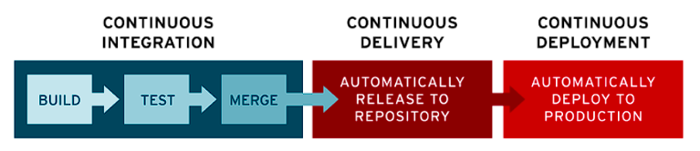

# Software_Quality_Assurance_Assessment

| **Team member** | **Contribution** | **Verified by** |
| --------- | --------- | --------- |
| Brandon   | - Created the project plan and assigned tasks   - Arranged meetings   - Did most of the research and wrote most of the section on Task Estimation   - Did the Introduction   - Set up most of the github repository  | Theo   |
| Theo   | - Did most of the research and wrote most of the section on Code reviews   - Did most of the research and wrote most of the section on Continuous Integration/Continuous Deployment (CI/CD)   - Did the conclusion   | Brandon   |

Here you can find the totality of the Handbook Content

# Handbook Content - Introduction

Welcome to our company handbook on software quality! This document serves as a comprehensive guide for software engineers at our startup to adopt best practices in order to ensure high-quality software development. With the rapid growth of our team, it's essential to establish consistent methodologies to enhance productivity, mitigate defects, and improve project predictability.

This handbook is structured into three main sections: Task Estimation in Scrum, Code Reviews, and Continuous Integration/Continuous Deployment (CI/CD). Each section provides an overview of the topic, key guidelines, and links to insightful resources for further exploration.

# Handbook Content - Task Estimation in Scrum

**Introduction:** Task estimation is a fundamental aspect of Scrum methodology, essential for planning and executing projects effectively. Through research and analysis of various resources, we've identified key insights and best practices to improve task estimation accuracy within our team.

## **The main axes:**

1. **Importance of Relative Estimation:** Most resources emphasize the value of relative estimation techniques such as Planning Poker. These methods focus on comparing the relative size or effort of tasks rather than estimating absolute time or complexity. By involving the entire team in the estimation process, diverse perspectives are considered, leading to more accurate estimations.

2. **Break Tasks into Smaller Units:** Breaking down tasks into smaller, more manageable units is consistently highlighted as a best practice. Smaller tasks are easier to estimate accurately and provide greater visibility into project progress. This approach also allows for better risk management and enables the team to adapt more efficiently to changes in requirements.

3. **Accounting for Uncertainty:** A recurring theme is the importance of accounting for uncertainty and risk during task estimation. Teams are encouraged to add buffer time or contingency plans to accommodate unexpected challenges or delays. By acknowledging and mitigating uncertainties upfront, teams can avoid underestimation and better manage stakeholder expectations.

4. **Regular Review and Adaptation:** Continuous improvement is emphasized across all resources, emphasizing the need for regular review and adaptation of estimation practices. Teams are encouraged to track their performance, evaluate the accuracy of past estimations, and adjust their approach accordingly. This iterative process helps teams refine their estimation techniques over time and improve overall predictability.

5. **Avoiding Biases:** Resources caution against common biases that can affect estimation accuracy, such as anchoring bias. Providing initial estimates before team discussions or being influenced by previous estimations can skew results. Encouraging open and collaborative discussions during estimation sessions helps mitigate these biases and leads to more objective estimations.

## **Key Guidelines:**

- **Use Relative Estimation Techniques:** Embrace methods like Planning Poker to involve the entire team and leverage diverse perspectives for more accurate estimations.

- **Break Tasks into Smaller Units:** Decompose tasks into smaller, more manageable units to improve accuracy and visibility into project progress.

- **Account for Uncertainties:** Incorporate buffer time or contingency plans to address uncertainties and mitigate risks during estimation.

- **Regularly Review and Adjust:** Continuously evaluate past estimations, track team performance, and adjust estimation techniques based on feedback and historical data.

- **Avoid Biases:** Foster an environment of open discussion and collaboration to prevent biases like anchoring bias from impacting estimation accuracy.

## **Resources:**

1. [agile estimating and planning summary by Myke Cohn](https://cdn.bookey.app/files/pdf/book/en/agile-estimating-and-planning.pdf) - Mike Cohn shares practical insights on agile estimation techniques and common pitfalls.

2. [Estimating with story points](https://www.agilealliance.org/the-practice-of-sizing-spikes-with-story-points/) - This Agile Alliance article explores the concept of story points and how they facilitate more accurate estimations.

3. [Common estimations Techniques for Agile projects](https://www.scrum.org/resources/blog/exploring-estimation-approaches-what-right-fit-scrum-teams) - Scrum.org offers an overview of popular estimation techniques used in agile projects

4. [The Science and Art of Software Estimation](https://www.infoq.com/articles/software-estimation-important/) - This InfoQ article delves into the complexities of software estimation and strategies for improving accuracy.

5. [How to track and estimate time in Trello](https://wobbly.me/blog/how-to-track-time-in-trello) - This Wobbly article is showing the best way to use trello to improve your time tracking of a task

**Conclusion:** By implementing these guidelines and leveraging insights from the provided resources, our team can enhance the accuracy and reliability of task estimation in our Scrum processes, leading to improved project predictability and delivery success.

# Importance of Code Reviews in Software Development

In the IT world, code reviews are very important for improving code quality and encouraging collaboration between developers. Code review is the practice of going back over one's code to find bugs or problems to improve or correct it. Within a team, the person carrying out the code review is often not the author of the code, enabling an external opinion and validation by multiple people. As this article shows, code reviews are essential in companies where teams work together.

"Code reviews play a pivotal role in ensuring the quality, reliability, and maintainability of software projects. By fostering a culture of collaboration, sharing knowledge, and maintaining coding standards, teams can harness the full potential of code reviews to deliver high-quality software products." [Source](https://codeinstitute.net/global/blog/the-importance-of-code-reviews/#:~:text=Code%20reviews%20play%20a%20pivotal,deliver%20high%2Dquality%20software%20products.)

A study shows that when developers know their code will be reviewed by a teammate, they produce more thorough work and ensure that their code passes all the automatic tests. As this article shows, "When developers know their code will be reviewed by a teammate, they make an extra effort to ensure that all tests are passing and the code is as well-designed as they can make it so the review will go smoothly." [Source](https://www.atlassian.com/agile/software-development/code-reviews#:~:text=Code%20reviews%20should%20integrate%20with,the%20code%20is%20merged%20upstream.)

In the software development process, code reviews are very important for producing clean code that is understood by the whole team. To ensure that the process is as clear as possible, the simplest way is to assign the people who will review each person's code in advance when planning the tasks. As soon as a task has been completed, the person responsible for reviewing the code can then get to work, as this article suggests: "after all the code has been written and automated tests have been run and passed-but before the code is merged upstream" [Source](https://www.atlassian.com/agile/software-development/code-reviews#:~:text=Code%20reviews%20should%20integrate%20with,the%20code%20is%20merged%20upstream.)

During a code review, the simplest thing to do is to create a code standard within the team beforehand so that the person reviewing the code can easily understand it. If the code is still technical and complicated to understand despite the existence of a code standard, the author can add comments. Firstly, this will speed up the code review, and secondly, if another developer has to work on this part of the code in the future, it will be easier for them to understand it.

During a code review, it is still important to offer constructive criticism of the code. Never offer personal criticism or anything else, as this would damage group cohesion and therefore the team's performance, which is not the desired aim. Feedback must be clear, constructive, and specific. This will enable everyone to improve and thus increase the team's overall productivity in developing an application. To back up my comments, we can look at the practices recommended by GitHub: "In general, it is important to be courteous and respectful while also being very clear and helpful to the developer whose code you are reviewing. One way to do this is to be sure that you are always making comments about the code and never making comments about the developer." [Source](https://google.github.io/eng-practices/review/reviewer/comments.html).

# The Importance of Continuous Integration and Continuous Deployment (CI/CD)

In the IT world, code reviews are very important for improving code quality and encouraging collaboration between developers. Code review is the practice of going back over one's code to try to find bugs or problems in order to improve or correct it. Within a team, the person carrying out the code review is often not the author of the code, to enable him or her to have an external opinion and for the code to be validated by several people. As this article shows, code reviews are essential in companies where teams work together.

"[Code reviews play a pivotal role in ensuring the quality, reliability, and maintainability of software projects. By fostering a culture of collaboration, sharing knowledge, and maintaining coding standards, teams can harness the full potential of code reviews to deliver high-quality software products.](https://codeinstitute.net/global/blog/the-importance-of-code-reviews/#:~:text=Code%20reviews%20play%20a%20pivotal,deliver%20high%2Dquality%20software%20products.)"

A study shows that when developers know their code will be reviewed by a teammate, they produce more thorough work and ensure that their code passes all the automatic tests. As this article shows, "[When developers know their code will be reviewed by a teammate, they make an extra effort to ensure that all tests are passing and the code is as well-designed as they can make it so the review will go smoothly.](https://www.atlassian.com/agile/software-development/code-reviews#:~:text=Code%20reviews%20should%20integrate%20with,the%20code%20is%20merged%20upstream.)"

In the software development process, code reviews are very important for producing clean code that is understood by the whole team. To ensure that the process is as clear as possible, the simplest way is to assign the people who will review each person's code in advance when planning the tasks. As soon as a task has been completed, the person responsible for reviewing the code can then get to work, as this article suggests: "[after all the code has been written and automated tests have been run and passed-but before the code is merged upstream.](https://www.atlassian.com/agile/software-development/code-reviews#:~:text=Code%20reviews%20should%20integrate%20with,the%20code%20is%20merged%20upstream.)"

During a code review, the simplest thing to do is to create a code standard within the team beforehand so that the person reviewing the code can easily understand it. If the code is still technical and complicated to understand despite the existence of a code standard, the author can add comments. Firstly, this will speed up the code review, and secondly, if another developer has to work on this part of the code in the future, it will be easier for them to understand it.

During a code review, it is still important to offer constructive criticism of the code. Never offer personal criticism or anything else, as this would damage group cohesion and therefore the team's performance, which is not the desired aim. Feedback must be clear, constructive and specific. This will enable everyone to improve and thus increase the team's overall productivity in developing an application. To back up my comments, we can look at the practices recommended by github: "[In general, it is important to be courteous and respectful while also being very clear and helpful to the developer whose code you are reviewing. One way to do this is to be sure that you are always making comments about the code and never making comments about the developer.](https://google.github.io/eng-practices/review/reviewer/comments.html.)"

---

# Introduction to Continuous Integration/Continuous Deployment (CI/CD)

The principle of CI/CD is to ensure that there is continuous development in order to accelerate the software development life cycle. It also avoids all the deployment headaches of the usual large deployments - all the problems are smaller and simpler to deal with.

[RedHat provides a comprehensive overview of CI/CD.](https://www.redhat.com/fr/topics/devops/what-is-ci-cd)

**Objectives of CI (Continuous Integration):**
- Regularly merge code modifications into a shared repository, such as a Git repository, several times a day.
- An automation process is triggered to compile the code and run automated tests.
- Rapidly detect and correct integration problems, thereby reducing the risks associated with code conflicts and ensuring high code quality.

**Objectives of CD (Continuous Deployment):**
- Automate the process of deploying applications to different environments.
- An automation process is started to build, test and deploy the application in a target environment.
- Reducing the time between development and production release, enabling teams to quickly deliver functionality to end users while maintaining a high level of quality and stability.

Several tools are available for CI/CD, including Jenkins and GitLab CI/CD. Jenkins is a free, open-source tool. It can work for both small and very large teams. The tool allows a great deal of flexibility and customization. The disadvantages are the complexity of setting up the tool and the difficulty of use for beginners. In comparison, GitLab CI/CD is easier to use but a little less customizable; the tool is directly integrated into the Github tool, which can make it easier to use if you already use this tool in your company.

---

# Creation of Continuous Integration/Continuous Deployment (CI/CD) Pipelines:

1. Compiling the code.
2. Test execution.
3. Building artifacts.
4. Deployment to test, pre-production, and production environments.

# Summary

Our company's commitment to excellence in software development is evident through the implementation of various best practices described in our manual. These practices include effective task estimation in Scrum, with a focus on relative estimation techniques, task decomposition, risk management, iterative improvement, and bias avoidance. By following these guidelines, we can improve the accuracy of project planning, which improves predictability and successful deliveries.

Moreover, our adoption of Continuous Integration and Continuous Deployment (CI/CD) principles ensures streamlined development processes, rapid problem detection, and efficient application deployment. This approach not only accelerates the software development lifecycle but also maintains high standards of quality and stability, allowing for rapid delivery of functionality to end-users.

Furthermore, the focus on code revisions as a cornerstone of our development process underscores our commitment to maintaining code quality, fostering collaboration, and meeting coding standards. Establishing clear review processes, defining code standards, providing constructive feedback, and maintaining a respectful environment are critical to ensuring our codebase remains clean, understandable, and conducive to team productivity.